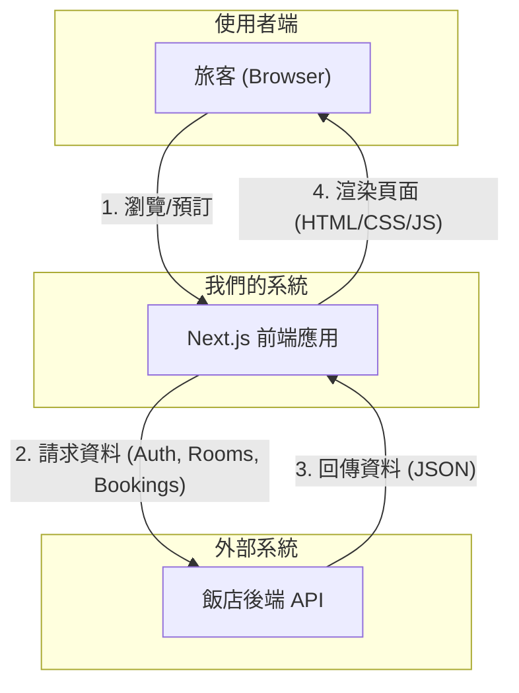

### **系統架構：飯店品牌訂房系統 (v1.0)**

#### 1. 概覽 (C4 模型 - Level 2)

本系統是一個基於 Next.js 的前端應用，它透過一個已有的外部 API 來提供服務。



- **Next.js 前端應用:** 這是我們開發的核心。它將處理所有 UI 渲染、使用者互動和狀態管理。我們將利用 Next.js 的混合渲染能力：對行銷和內容頁面（如首頁）使用**伺服器端渲染 (SSR)** 或**靜態網站生成 (SSG)** 以獲得最佳效能和 SEO；對高度互動的訂房流程和帳戶管理頁面使用**客戶端渲染 (CSR)**。

#### 2. 前端應用元件架構 (C4 模型 - Level 3)

我建議採用功能驅動 (feature-driven) 的方式來組織我們的元件和邏輯，這有助於保持程式碼的清晰和可維護性。

**建議的資料夾結構:**

```
src/
├── app/                  # Next.js App Router - 頁面路由
│   ├── /                 # 首頁 (US-1)
│   ├── rooms/            # 房間列表/搜尋頁 (US-2)
│   ├── rooms/[id]/       # 房間詳情頁 (US-3)
│   ├── booking/          # 訂房流程頁 (US-4)
│   └── account/          # 使用者帳戶相關頁面
│       └── bookings/     # 我的訂單頁 (US-5)
│
├── components/           # 可重複使用的 React 元件
│   ├── ui/               # 由 shadcn-cli 產生的基礎 UI 元件 (Button, Input, etc.)
│   └── feature/          # 特定功能的複合元件 (e.g., HeroShowcase, BookingForm)
│
├── lib/                  # 核心邏輯與工具
│   ├── api.ts            # 集中管理所有對後端 API 的請求 (使用 SWR)
│   └── utils.ts          # 通用輔助函式
│
└── store/                # Zustand 狀態管理
    ├── userStore.ts      # 管理使用者認證狀態 (token, user info)
    └── bookingStore.ts   # 管理跨步驟的訂房流程狀態
```

#### 3. 核心技術決策

**a. 資料流 (Data Flow) & 快取**

- **推薦使用 `SWR`:** 為了滿足效能需求並簡化資料獲取邏輯，我強烈建議使用 `SWR` 這個由 Vercel 開發的庫。它能與 Next.js 完美配合，自動處理快取、重新驗證和載入狀態，從而提升使用者體驗和開發效率。我們將在 `lib/api.ts` 中封裝 `SWR` 的 hooks。
- **伺服器端獲取:** 對於首頁和房間詳情等頁面，我們將在伺服器端預先獲取資料，以達成 PRD 中 `<2秒` 的載入時間目標。

**b. 狀態管理 (State Management)**

- **`userStore` (Zustand):** 用於儲存 JWT token 和使用者基本資料。當使用者登入後，此 store 的狀態將被更新，並可選擇性地同步到 `localStorage` 以維持登入狀態。
- **`bookingStore` (Zustand):** 用於管理複雜的訂房流程。當使用者選擇日期、房間、填寫資料時，所有臨時狀態都存放在此，避免了元件之間繁瑣的 props 傳遞，也讓 `<90秒` 完成預訂的目標更容易達成。

**c. UI 元件庫**

- **shadcn/ui:** 這是個極佳的選擇。它提供了高品質、可訪問性強的基礎元件，同時給予我們完全的客製化能力，讓我們可以快速打造出符合飯店品牌形象的 UI，同時確保開發速度。
